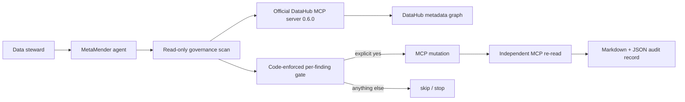

# MetaMender

**A governance steward that finds metadata debt, explains the risk, and repairs
only the DataHub changes a human explicitly approves.**

Metadata catalogs rarely fail all at once. They decay one missing owner, blank
description, and unclassified sensitive field at a time. MetaMender turns that
drift into a prioritized work queue, then closes approved gaps through the
official DataHub MCP server.

Built for **Build with DataHub: The Agent Hackathon**, Track 1 — Agents That Do
Real Work.

**Demo:** [watch the 1:53 end-to-end DataHub repair](https://youtu.be/5BLmMYNmkWE) ·
**Submission:** [Devpost](https://devpost.com/software/metamender)

## Why this is different

"Scan the catalog, then auto-fix the metadata" is the obvious shape of this
challenge, and plenty of entries will have it. MetaMender bets on the harder
question, whether anyone would actually run it against a production catalog, and
answers with responsible write-back:

- **Every write is gated on one explicit human `yes`.** There is no batch
  approval. The gate lives in code (`agent/src/harness.ts`), not in a prompt, and
  a test proves it cannot be bypassed. Auto-rewriting production metadata in bulk
  is exactly the thing no data team will turn on.
- **Severity is lineage-aware, not a flat list.** A PII gap on a table with live
  downstream consumers ranks above the same gap on a leaf table, so the
  highest-blast-radius work surfaces first. The agent spells out that evidence
  before it asks for the write.

## What it does

1. Scans up to 100 DataHub datasets through MCP.
2. Detects missing owners, missing descriptions, PII-looking fields without the
   configured PII glossary term, and datasets with no upstream or downstream
   lineage as orphan review candidates.
3. Ranks findings by risk (live downstream consumers raise a finding's severity)
   and explains the evidence in plain English.
4. Shows one exact proposed mutation at a time.
5. Requires a fresh terminal `yes` for that single mutation.
6. Writes the approved owner, description, or glossary term back to DataHub.
7. Re-reads DataHub independently and emits Markdown plus JSON audit evidence.

PII name matching produces **review candidates**, not claims about the underlying
data. Orphans are reported only when both lineage reads succeed and return zero;
they are never auto-fixed.

## The safety boundary is code, not a prompt

The Claude-driven and deterministic modes share the same gate in
`agent/src/harness.ts`:

- A model can mutate only a finding returned by the latest scan.
- The full URN, finding kind, column, and proposed fix are printed before action.
- Only `yes` or `y` authorizes a write; EOF, silence, and every other answer fail
  closed.
- One confirmation authorizes one finding. There is no batch approval.
- Every completed write is re-read from DataHub before it is marked verified.



## DataHub integration

MetaMender uses the published
[`mcp-server-datahub`](https://pypi.org/project/mcp-server-datahub/) package,
pinned to `0.6.0` for reproducibility.

| Phase | DataHub MCP tools |
| --- | --- |
| Discover | `search`, `get_entities`, `list_schema_fields`, `get_lineage` |
| Repair | `add_owners`, `update_description`, `add_terms` |
| Verify | `get_entities`, `list_schema_fields` |

The optional Claude path uses the
[`@anthropic-ai/claude-agent-sdk`](https://www.npmjs.com/package/@anthropic-ai/claude-agent-sdk)
to orchestrate the same guarded tools. Without an Anthropic key, the complete
scan, confirmation, write-back, verification, and audit flow still runs through
a deterministic orchestrator.

## Quick start

### Prerequisites

- Node.js 20.12 or newer
- Docker
- Python `uv` / `uvx`
- DataHub CLI and a reachable DataHub GMS endpoint

For a local evaluation catalog:

```bash
python3 -m pip install acryl-datahub
datahub docker quickstart
datahub init --username datahub --password datahub
datahub datapack load showcase-ecommerce
```

Install and configure MetaMender:

```bash
git clone https://github.com/yangyangnovelist-hub/metamender.git
cd metamender
npm install
cp .env.example .env
```

Before a real repair, set `METAMENDER_OWNER_URN` and
`METAMENDER_PII_TERM_URN` to your organization's accountable owner and glossary
term. `METAMENDER_SCOPE_LABEL` names the catalog/environment in audit evidence.

Make sure `uvx` is on `PATH`, then run the read-only scan:

```bash
npm run scan -- --dry-run
npm run scan -- --json
```

Run the guarded remediation agent:

```bash
npm run agent
```

Narrow a demo or maintenance round to exact targets by repeating `--target`:

```bash
npm run agent -- \
  --target 'pii-untagged/town_city@snowflake,b2fd91.order_entry_db.order_entry.addresses' \
  --target 'missing-owner@postgres,b2fd91.order_entry_db.order_entry.warehouses'
```

Set `ANTHROPIC_API_KEY` in the environment to enable Claude Agent SDK
orchestration. Do not add it to a committed file. The agent enables DataHub MCP
mutation tools inside its writer session, but the local confirmation gate remains
mandatory for every write.

Audit pairs are written to `examples/audit-<timestamp>.md` and `.json` by
default. Use `--report-dir <directory>` to change the destination.

## Verification

```bash
npm test
npm run typecheck
npm run test:integration
npm audit
```

Current verified baseline:

- 85 default tests pass; 3 more real MCP checks pass against a local DataHub
  quickstart.
- TypeScript type checking passes.
- The dependency audit reports zero known vulnerabilities.
- A live read-only scan has surfaced real sample-catalog findings, including
  `addresses.town_city` without a PII term, `warehouses` without an owner, and
  `orders` without a description.

The integration suite never performs a mutation. A real write-back occurs only
when an operator runs the agent and types `yes` for the displayed finding.

## Bonus open-source contribution

The official [`datahub-project/datahub-skills`](https://github.com/datahub-project/datahub-skills)
repository routes systematic governance audits to `/datahub-audit`, but does not
currently include that skill. We submitted
[datahub-project/datahub-skills#70](https://github.com/datahub-project/datahub-skills/pull/70),
a validated read-only `datahub-audit` contribution plus its command alias. It is
deliberately independent of MetaMender so the wider DataHub community can reuse the
workflow with any Agent Skills-compatible client.

## Scope and limitations

- The default scan is bounded to the first 100 matching datasets.
- The PII name heuristic is deliberately narrow. The target glossary term is
  configured with `METAMENDER_PII_TERM_URN` for each organization.
- Missing-owner fixes use `METAMENDER_OWNER_URN`; the example file defaults to
  the quickstart user `urn:li:corpuser:datahub` and must be replaced before a
  production write.
- Auto-drafted descriptions are visibly prefixed with `Drafted by MetaMender —`
  and should be refined by a steward.
- This release does not auto-create lineage or delete/deprecate entities.

## Prior work and third-party disclosure

The code-enforced confirmation-gate architecture and in-process Claude SDK MCP
pattern were adapted from the team's pre-existing ApprovalSentinel project. All
DataHub-specific detectors, MCP mappings, verification, audit reporting, and the
`datahub-audit` contribution were built for this hackathon. MetaMender depends on
the official DataHub MCP server, DataHub's showcase data, Anthropic SDKs, the
Model Context Protocol SDK, Zod, TypeScript, and Vitest; each retains its own
license.

MetaMender is licensed under [Apache License 2.0](LICENSE).
